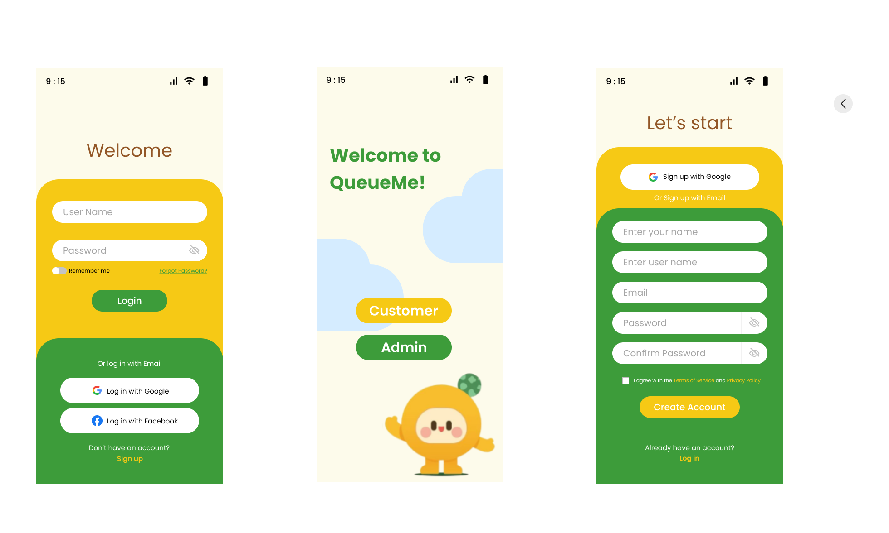
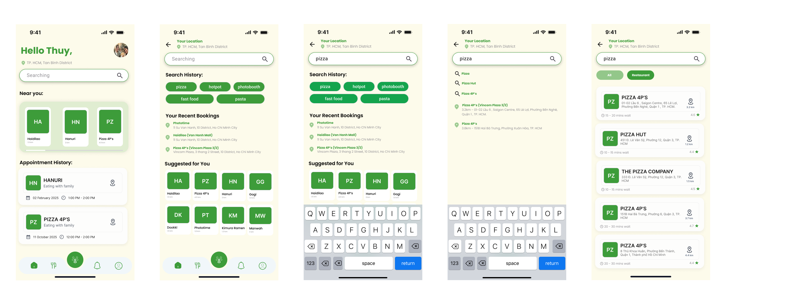
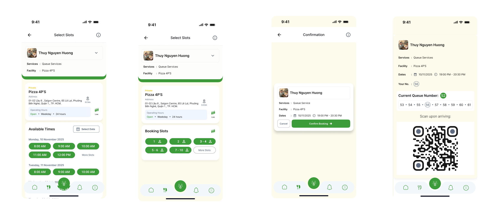
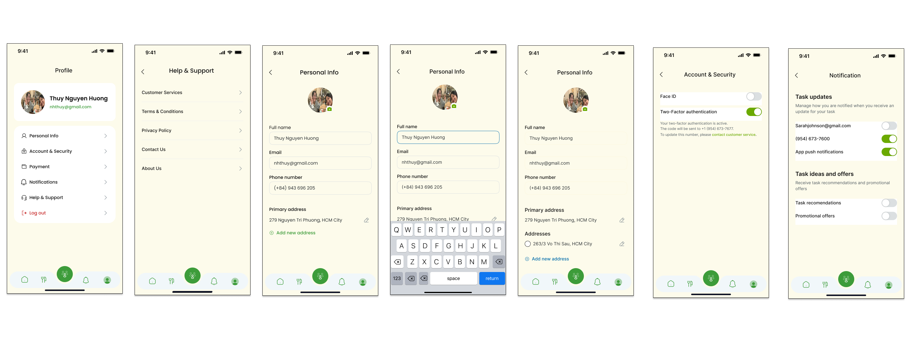
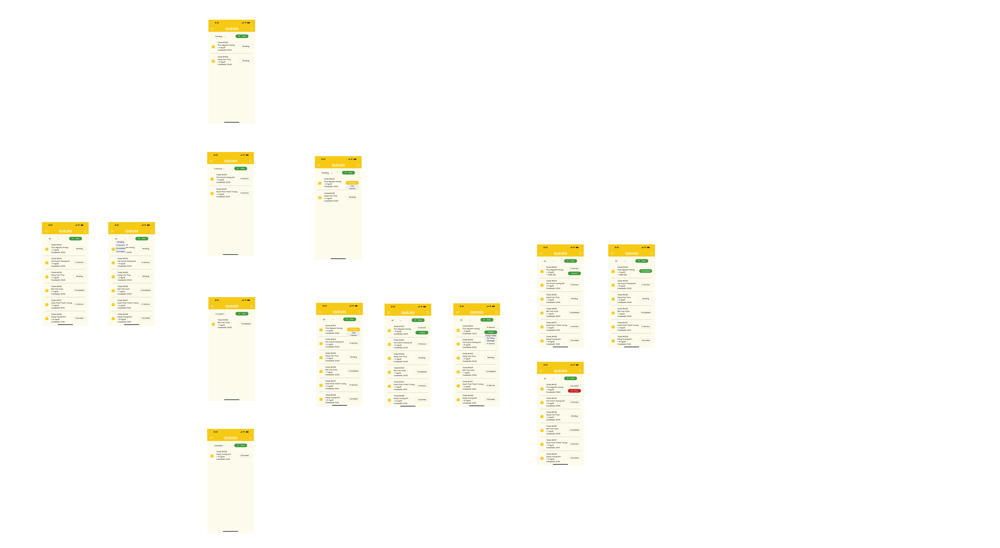
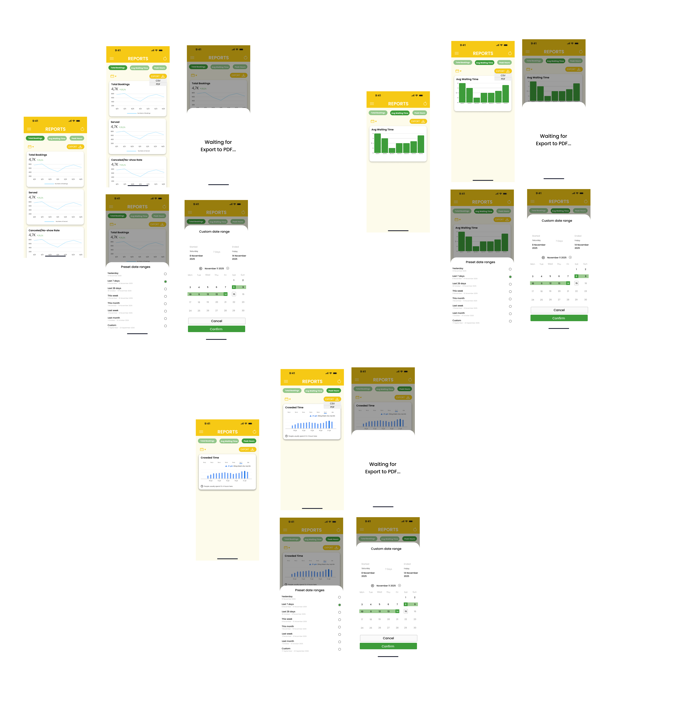
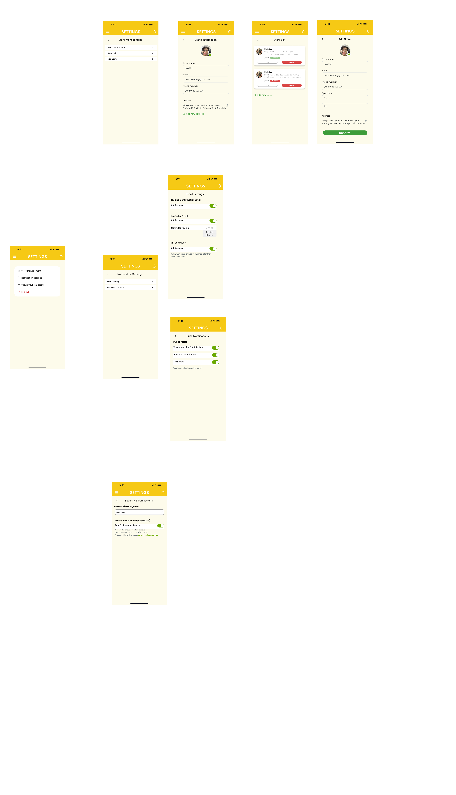
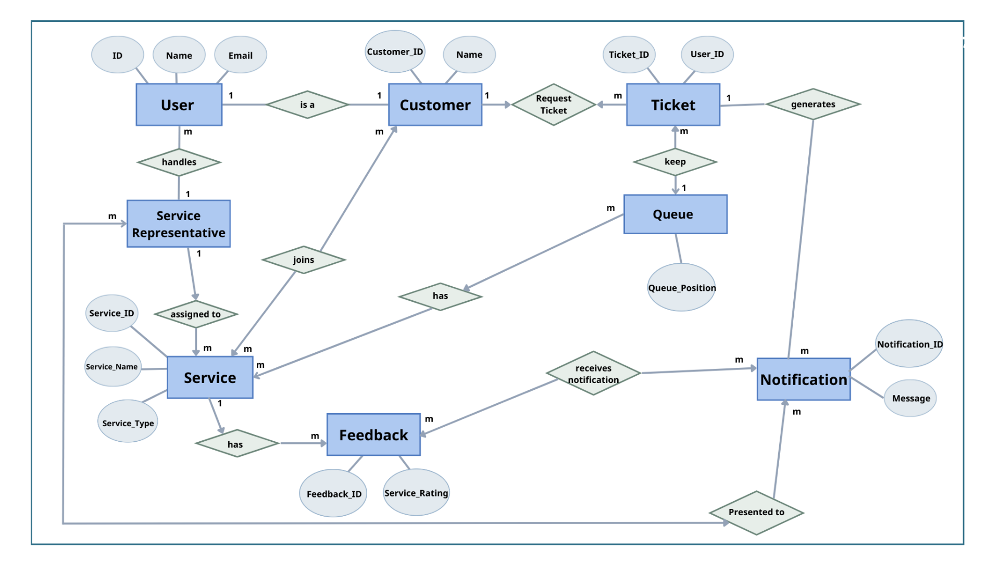

# QueueMe – Virtual Queue Management System

> A digital queue management platform designed to reduce waiting time and improve customer experience through real-time queue tracking and notifications.

---

## 👤 My Role

**Team Leader & Full-Stack Developer**

As the team leader, I was responsible for project planning, task coordination, system analysis, and the development of core system functionalities.

### Key Responsibilities

* Led project planning, execution, and final delivery.
* Coordinated team members and monitored development progress.
* Analyzed business requirements and translated them into system functionalities.
* Designed system workflows, business logic, and database structure.
* Developed major frontend and backend features.
* Conducted system testing and debugging.

---

## 🎯 Project Overview

QueueMe was developed to address inefficiencies in traditional queue management processes where customers are required to wait physically without clear visibility into queue progress.

The platform enables customers to join queues remotely, track waiting status in real time, receive notifications before their turn, and provide feedback after service completion.

Meanwhile, administrators can manage services, monitor queue operations, and review business reports through a centralized dashboard.

---

## 🚨 Problem Statement

Traditional queue systems often create poor customer experiences due to:

* Long waiting times.
* Lack of queue transparency.
* Limited customer engagement during waiting periods.
* Difficulty monitoring queue performance.
* Manual queue management processes.

These challenges reduce customer satisfaction and operational efficiency.

---

## 💡 Solution

QueueMe digitizes the entire queueing experience by allowing customers to:

* Register and join queues remotely.
* Receive digital queue tickets.
* Monitor queue positions in real time.
* Receive automated notifications when their turn approaches.
* Submit service feedback after completion.

Administrators are provided with tools to manage services, monitor queues, and analyze operational performance.

---

## ✨ Key Features

### Customer Application

* User Registration & Authentication
* Service Selection
* Queue Registration
* Real-Time Queue Tracking
* Notification Management
* Feedback Submission

### Admin Dashboard

* Service Management
* Queue Monitoring
* Customer Management
* Queue Analytics
* Reporting Dashboard

---

## 🔄 Product Workflow

```text
Customer Login
      ↓
Select Service
      ↓
Join Queue
      ↓
Receive Queue Ticket
      ↓
Track Queue Status
      ↓
Receive Notification
      ↓
Check-in
      ↓
Complete Service
      ↓
Submit Feedback
```

---

## 🎥 Demo Videos

| Feature              | Demo                              |
| -------------------- | --------------------------------- |
| Customer Application | demo/Customer_App_Demo.mp4        |
| Queue Management     | demo/Queue_Management_Demo.mp4    |
| Service Management   | demo/Service_Management_Demo.mp4  |
| Reporting Dashboard  | demo/Reporting_Dashboard_Demo.mp4 |
| Admin Dashboard      | demo/Admin_Dashboard_Demo.mp4     |

---

# 📱 Customer Application

## Login Screen



## Home & Search



## Queue Tracking



## Account Management



---

# 🖥️ Admin Dashboard

## Queue Management



## Reporting Dashboard



## Settings Management



---

# 🏗️ System Design

## Conceptual ERD



The conceptual model describes relationships among users, customers, services, tickets, queues, notifications, and feedback entities.

---

## Physical Database Schema


The database design supports queue management, customer management, notifications, service administration, and reporting functionalities.

---

# 🛠️ Technology Stack

### Frontend

* Flutter

### Backend

* ASP.NET Core Web API

### Database

* SQL Server

### Development Tools

* Visual Studio
* Git & GitHub
* Postman
* Figma

---

# 📂 Repository Structure

```text
backend/
├── Controllers
├── DTOs
├── Models
├── Services
└── Migrations

frontend/
├── lib
├── assets
└── screens

demo/
├── Customer_App_Demo.mp4
├── Queue_Management_Demo.mp4
├── Service_Management_Demo.mp4
├── Reporting_Dashboard_Demo.mp4
└── Admin_Dashboard_Demo.mp4

screenshots/
├── admin/
└── users/

docs/
└── System Design Documents

report/
└── Project Report
```

---

# 🚀 Key Achievements

* Developed a complete virtual queue management solution from requirement analysis to implementation.
* Designed a real-time queue tracking workflow to improve customer visibility and convenience.
* Built both customer-facing and administrative functionalities.
* Applied database modeling and API development practices in a real-world project environment.
* Led project execution and coordinated team collaboration throughout the development lifecycle.

---

# 📚 Key Learning Outcomes

Through this project, I gained hands-on experience in:

* Product Requirement Analysis
* User Journey Mapping
* Database & System Design
* Full-Stack Application Development
* Team Leadership
* Agile Collaboration
* Problem Solving & Product Thinking
* End-to-End Product Development
